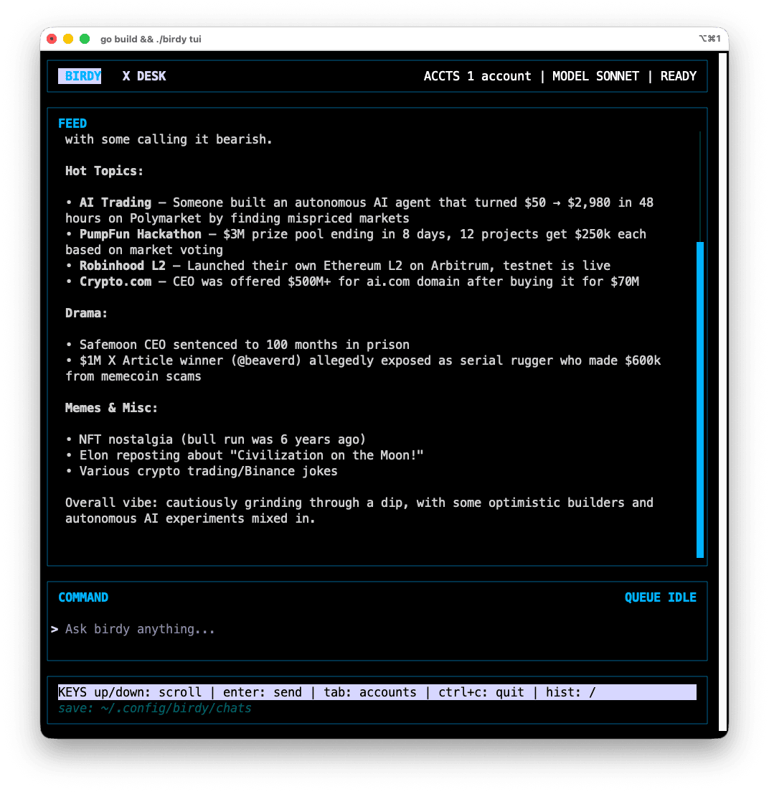

# birdy

Multi-account proxy for the [bird](https://github.com/steipete/bird) CLI. Store multiple X/Twitter auth tokens and automatically rotate between accounts to reduce rate-limit risk.

## First Run (Install + Open TUI)

```bash
curl -fsSL https://raw.githubusercontent.com/guzus/birdy/main/install.sh | bash && birdy account add main && birdy tui
```

`birdy account add main` will prompt you for `auth_token` and `ct0` from your X/Twitter browser session.

## Interactive TUI

Launch the full-screen terminal interface with AI-powered chat:

```bash
birdy tui
```



The TUI features:
- **Chat** — Ask birdy to read your timeline, search tweets, post, and more via Claude
- **Deep browsing** — Say "dive deeper" and birdy will autonomously explore threads, replies, and user profiles
- **Account management** — Add, remove, and view accounts with `tab`
- **Chat history** — Conversations are saved as markdown in `~/.config/birdy/chats/`

## How it works

birdy sits in front of the `bird` CLI. When you run a bird command through birdy, it:

1. Picks an account from your stored credentials using a rotation strategy
2. Injects the `AUTH_TOKEN` and `CT0` environment variables
3. Forwards the command to `bird`
4. Tracks usage per account for smart rotation

## Install

```bash
curl -fsSL https://raw.githubusercontent.com/guzus/birdy/main/install.sh | bash
```

Requires the [GitHub CLI](https://cli.github.com) (`gh`). To install a specific version, pass it as an argument: `... | bash -s v0.2.0`

### Alternatives

```bash
# From source (requires Go)
go install github.com/guzus/birdy@latest

# Build locally
git clone https://github.com/guzus/birdy.git && cd birdy && make build
```

If you install via `go install`, only the `birdy` binary is installed, so you still need [bird](https://github.com/steipete/bird) available on your PATH (or set `BIRDY_BIRD_PATH`).

If you build from a git clone, bird is vendored under `third_party/@steipete/bird/` (requires Node `>= 22`).

## Prerequisites

- The installer bundles the upstream [bird](https://github.com/steipete/bird) CLI and installs it as `birdy-bird` (birdy will auto-detect it). The bundled bird requires Node `>= 22`.
- [Claude Code](https://claude.ai/claude-code) (`claude` CLI) — required for the interactive TUI (`birdy tui`)

To force a specific bird binary, set `BIRDY_BIRD_PATH=/path/to/bird`.

## Quick start

```bash
# Add accounts (you'll be prompted for auth_token and ct0)
birdy account add personal
birdy account add work
birdy account add alt

# Or pass credentials directly
birdy account add bot --auth-token "xxx" --ct0 "yyy"

# Now use bird commands through birdy - accounts rotate automatically
birdy read 1234567890
birdy search "golang"
birdy home
birdy mentions

# See which account was used with --verbose
birdy -v home

# Use a specific account
birdy --account personal whoami

# Check rotation status
birdy status

# List accounts
birdy account list
```

## Account management

```bash
birdy account add <name>       # Add account (interactive or with --auth-token/--ct0)
birdy account list              # List all accounts with usage stats
birdy account update <name>     # Update credentials for an account
birdy account remove <name>     # Remove an account
```

## Rotation strategies

Control how birdy picks the next account with `--strategy` / `-s`:

| Strategy | Description |
|---|---|
| `round-robin` (default) | Cycles through accounts in order |
| `least-recently-used` | Picks the account used longest ago |
| `least-used` | Picks the account with the fewest total uses |
| `random` | Picks a random account |

```bash
birdy -s least-used search "rust"
birdy -s random home
```

## Getting auth tokens

You need two cookies from an active X/Twitter web session:

1. Open X/Twitter in your browser and log in
2. Open Developer Tools (F12) > Application > Cookies > `https://x.com`
3. Copy the values of `auth_token` and `ct0`

Repeat for each account you want to add.

## GitHub Actions / CI

In CI environments where there's no interactive terminal, set the `BIRDY_ACCOUNTS` env var with a JSON array of accounts:

```bash
export BIRDY_ACCOUNTS='[{"name":"bot1","auth_token":"xxx","ct0":"yyy"},{"name":"bot2","auth_token":"aaa","ct0":"bbb"}]'
birdy -v read 1234567890
```

When `BIRDY_ACCOUNTS` is set and no accounts file exists on disk, birdy runs in ephemeral mode — accounts are loaded from the env var and nothing is written to disk.

If an accounts file also exists, env accounts are merged in (overriding any file account with the same name).

### GitHub Actions example

Store the JSON as a repository secret named `BIRDY_ACCOUNTS`, then use it in your workflow:

```yaml
- name: Read a tweet
  env:
    BIRDY_ACCOUNTS: ${{ secrets.BIRDY_ACCOUNTS }}
  run: birdy -v read 1234567890
```

See [`.github/workflows/example.yml`](.github/workflows/example.yml) for a full workflow.

## Config location

Accounts are stored in `~/.config/birdy/accounts.json` with `0600` permissions (owner-only read/write). Rotation state is tracked in `~/.config/birdy/state.json`.

## License

MIT
