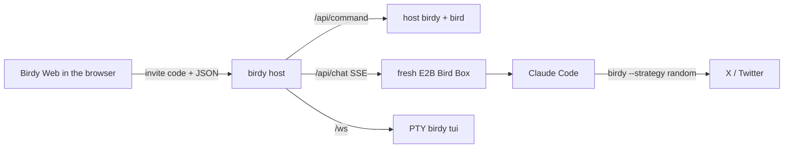

<p align="center">
  
</p>

# birdy

Multi-account proxy for the [bird](https://github.com/steipete/bird) CLI. Store multiple X/Twitter auth tokens and automatically rotate between accounts to reduce rate-limit risk.

## First Run (Install + Open TUI)

```bash
curl -fsSL https://raw.githubusercontent.com/guzus/birdy/main/install.sh | bash && birdy account add main && birdy tui
```

`birdy account add main` will prompt you for `auth_token` and `ct0` from your X/Twitter browser session.

## Interactive TUI

Launch the full-screen terminal interface with AI-powered chat:

```bash
birdy tui
```


The TUI features:
- **Chat** — Ask birdy to read your timeline, search tweets, post, and more via Claude or Codex
- **Deep browsing** — Say "dive deeper" and birdy will autonomously explore threads, replies, and user profiles
- **Model switching** — Press `Ctrl+T` to cycle `sonnet`, `opus`, `haiku`, and `codex`
- **Account management** — Add, remove, and view accounts with `tab`
- **Chat history** — Conversations are saved as markdown in `~/.config/birdy/chats/` (set `BIRDY_TUI_HIDE_HISTORY=1` to disable)

## Birdy Web

Birdy Web is the invite-gated React interface served by `birdy host`. It is
built for X-hitchhiking agents: a user asks for a timeline scan, research, or a
deep dive, and Claude works inside a disposable Bird Box sandbox. The sandbox
receives the configured X session set, and birdy randomly selects one account
for each command.

The hosted instance is available at [birdy.guzus.xyz](https://birdy.guzus.xyz).
Access is invite-only; DM [@uncanny_guzus](https://x.com/uncanny_guzus) on X to
request an invite code.

<p align="center">
  
  <br>
  <em>Bird Box — a sandbox for X-hitchhiking agents.</em>
</p>

The web app provides:

- **Timeline scans** — Claude explores home, search, and news feeds, then turns
  the results into source-linked alpha cards.
- **Streaming chat and Deep Dive** — `/api/chat` streams model text and birdy
  tool calls to the browser over server-sent events (SSE).
- **Browser-local persistence** — chat/card history is saved in that browser's
  `localStorage`; prompts and responses still pass through the birdy host, E2B,
  and the configured model provider during a request.
- **Invite-gated access** — the browser sends the configured invite code on
  API requests. Treat it as a full service credential: it grants X data access,
  the PTY TUI, and—unless read-only mode is enabled—mutating commands. Serve the
  host over TLS, set `BIRDY_READ_ONLY=1` for public research deployments, and
  rotate the code immediately after exposure.

The lower-level `/ws` route remains available to clients that want a
PTY-backed `birdy tui` session. It is separate from the React app at `/`.

### Run locally

Build the web client, then start the Go host:

```bash
(cd web && bun install && bun run build)
BIRDY_HOST_INVITE_CODE=local-dev go run . host --addr 127.0.0.1:8787
```

Open `http://127.0.0.1:8787` and enter `local-dev`. Add at least one birdy
account first, and have Claude Code installed/authenticated for local AI chat.
When `BIRDY_E2B_TEMPLATE` and `E2B_API_KEY` are set, Claude chat is routed to
Bird Box instead of running Claude Code on the host.

### Request flow


```mermaid
flowchart LR
    Browser["Birdy Web in the browser"] -->|"invite code + JSON"| Host["birdy host"]
    Host -->|"/api/command"| Local["host birdy + bird"]
    Host -->|"/api/chat SSE"| Box["fresh E2B Bird Box"]
    Box --> Claude["Claude Code"]
    Claude -->|"birdy --strategy random"| X["X / Twitter"]
    Host -->|"/ws"| TUI["PTY birdy tui"]
```

Claude models use Bird Box when it is configured. Codex model selections remain
host-local. Each Bird Box receives only the allowlisted runtime variables,
including the complete `BIRDY_ACCOUNTS` value, and streams its result through
the host. The host requests deletion after completion, failure, disconnect, or
timeout; the sandbox TTL is the cleanup backstop if deletion cannot reach E2B.

### HTTP API

The static app at `/` and `/healthz` are public. API operations authenticate
with `X-Invite-Code: <code>` or `Authorization: Bearer <code>`. `/ws` upgrades
first, then requires the invite code in its initial auth message. JSON bodies
are decoded strictly and unknown fields are rejected. JSON API failures use
`{"ok":false,"error":"..."}`; method-not-allowed responses have an empty body.

| Endpoint | Request | Response |
| --- | --- | --- |
| `GET /healthz` | none | `200 ok` |
| `POST /api/command` | `{"command":"search","args":["agents"]}` | JSON with `ok`, `account`, `exit_code`, `stdout`, `stderr`, and `duration_ms` |
| `POST /api/multi-command` | `{"operations":[{"id":"one","command":"news"}]}` | Ordered per-operation results; maximum 16 operations |
| `POST /api/chat` | `{"prompt":"Scan for AI agent news","model":"sonnet"}` | Zero or more `snapshot`, `token`, `tool_use`, or `error` SSE events; terminal `done` |
| `GET /ws` | WebSocket auth message, then terminal input/resize messages | PTY-backed TUI stream |

Example read-only calls:

```bash
curl -sS https://your-birdy-host.example/api/command \
  -H 'Content-Type: application/json' \
  -H 'X-Invite-Code: replace-with-invite-code' \
  -d '{"command":"search","args":["e2b agents"]}'

curl -N https://your-birdy-host.example/api/chat \
  -H 'Content-Type: application/json' \
  -H 'X-Invite-Code: replace-with-invite-code' \
  -d '{"prompt":"Find the strongest AI-agent signals today","model":"sonnet"}'
```

Command traffic is limited to 60 operations per minute per IP; a batch is
charged once per operation. Chat is limited to 20 requests per minute per IP.
At most eight bird subprocesses run concurrently across command endpoints.
For commands, HTTP `200` means the process ran; inspect `exit_code` for command
success. For chat, HTTP `200` can still contain an SSE `error` before `done`.
Write commands are **not idempotent**: never automatically retry `tweet`,
`reply`, `follow`, `unfollow`, or `unbookmark`. Set `BIRDY_READ_ONLY=1` for a
public research deployment.

### Host command

Run birdy as a browser-accessible service:

```bash
birdy host --addr 0.0.0.0:8787
```

birdy will print the local URL:

```text
http://127.0.0.1:8787
```

Users must enter an invite code to use the APIs or PTY TUI.

Notes:
- Set invite code with `--invite-code` or `BIRDY_HOST_INVITE_CODE`.
- For public deployments, set `BIRDY_READ_ONLY=1`.
- Set `BIRDY_HOST_ALLOWED_ORIGINS` when exposing the WebSocket TUI publicly.

## Deploy on Railway

This repo now includes a Railway-ready container setup:
- `Dockerfile`
- `scripts/entrypoint-railway.sh`
- `.env.railway.example`

### 1. Create service

Create a Railway service from this repo. Railway will detect and build the `Dockerfile`.

### 2. Build the bird-box template

The repository includes a source-controlled E2B template builder. It
cross-compiles birdy for Linux, starts from E2B's default base image, installs a
checksummed Node 22.23.1 runtime, and bakes in the pinned Claude Code and bird
CLIs. Go and Node.js must be available on the build host, and the builder
refuses a dirty worktree by default so the binary remains traceable to a commit.

```bash
npm ci --prefix e2b-runner
E2B_API_KEY=e2b_replace-with-api-key \
  npm --prefix e2b-runner run template:build
```

The builder creates a new immutable build, launches it for a smoke test, and
moves the `bird-box:production` tag only after `birdy`, `claude`, and `bird`
all work on `PATH` as E2B's non-root sandbox user. Set
`BIRDY_E2B_TEMPLATE_NAME` or `BIRDY_E2B_PROMOTION_TAG` to override those two
names.

`bird-box:production` is a movable release pointer. For strict rollback and
repeatability, set Railway's `BIRDY_E2B_TEMPLATE` to the immutable build target
printed by the builder (`bird-box:<build_id>`).

### 3. Add required variables

Set these in Railway Variables:

```bash
# Required: invite code users enter in the browser
BIRDY_HOST_INVITE_CODE=replace-with-long-random-secret

# Recommended for public deployments: disable write actions
BIRDY_READ_ONLY=1

# Optional: lock websocket origins to specific public domains
# BIRDY_HOST_ALLOWED_ORIGINS=https://your-domain.example,https://<railway-domain>

# Optional: hide/disable PTY TUI chat history. Birdy Web conversations remain
# in each browser's localStorage.
BIRDY_TUI_HIDE_HISTORY=1

# Required: X/Twitter accounts as JSON (single line)
BIRDY_ACCOUNTS=[{"name":"main","auth_token":"x_auth_token_here","ct0":"x_ct0_here"}]

# Required: bird-box remote Claude execution (powered by E2B)
E2B_API_KEY=e2b_replace-with-api-key
BIRDY_E2B_TEMPLATE=bird-box:production

# Required for AI chat (pick one auth method)
CLAUDE_CODE_OAUTH_TOKEN=replace-with-claude-code-oauth-token
# or
# ANTHROPIC_API_KEY=replace-with-anthropic-api-key
# or
# ANTHROPIC_AUTH_TOKEN=replace-with-anthropic-auth-token
```

### 4. Add persistent volume

Mount a Railway volume at:

```text
/data
```

This preserves:
- `~/.config/birdy/accounts.json`
- `~/.config/birdy/state.json`
- `~/.config/birdy/chats/`

### Bird Box container contract

bird-box is birdy's isolated Claude execution feature, backed by E2B.
`BIRDY_E2B_TEMPLATE` must identify a custom E2B template with `birdy`, `claude`,
and the underlying `bird` CLI already on `PATH`. Use `bird-box:<build_id>` for
an immutable pin, or a movable version tag such as `bird-box:production`. The
web host does not install these binaries or Node.js inside a running container.

Each Claude chat request gets a fresh bird-box container. The host forwards only
Claude authentication plus `BIRDY_ACCOUNTS` and `BIRDY_READ_ONLY`; the E2B API
key and birdy invite code never enter the sandbox. Output streams through the
existing SSE endpoint. The host immediately requests sandbox deletion after
completion, failure, disconnect, or timeout; the default seven-minute sandbox
TTL is the cleanup backstop if that request cannot reach E2B. Since rotation
state is ephemeral, Claude inside bird-box uses `birdy --strategy random`
instead of restarting round-robin at the first account.

The command, sandbox, and E2B request timeouts can be overridden with
`BIRDY_E2B_COMMAND_TIMEOUT_MS`, `BIRDY_E2B_SANDBOX_TIMEOUT_MS`, and
`BIRDY_E2B_REQUEST_TIMEOUT_MS`. The sandbox timeout must cover command startup,
execution, and cleanup. The two E2B request handshakes, command timeout, and
cleanup timeout must also fit inside the remaining web request deadline, which
the Go host passes to the runner internally; invalid combinations fail before
creating a sandbox.

### 5. Deploy and open

After deploy, open your Railway public URL and enter your invite code:

```text
https://<your-service-domain>
```

### Railway notes

- Keep this service at `1` replica so account rotation and persisted rate-limit
  state remain coherent. Browser conversations remain client-side.
- The container uses Node 22 + Claude Code CLI + bundled bird CLI.
- Rotate `BIRDY_HOST_INVITE_CODE` if it leaks.

## How it works

birdy sits in front of the `bird` CLI. When you run a bird command through birdy, it:

1. Picks an account from your stored credentials using a rotation strategy
2. Injects the `AUTH_TOKEN` and `CT0` environment variables
3. Forwards the command to `bird`
4. Tracks usage per account for smart rotation

## VPN routing (`--vpn`)

X's bot detection blocks by IP, so rotating auth tokens across 5 accounts from the same machine still trips Cloudflare after ~30 lookups. `--vpn` routes each bird call through a SOCKS5 endpoint (NordVPN's service credentials work out of the box), with per-invocation server selection so you can rotate exits as well as accounts.

```bash
# One-time setup
birdy vpn install-deps                              # installs Node 'undici' into ~/.cache/birdy
birdy vpn set --user <NORDVPN_SERVICE_USERNAME> --pass <NORDVPN_SERVICE_PASSWORD>
birdy vpn pool add us9876.nordvpn.com               # add as many as you want
birdy vpn pool add jp14.nordvpn.com

# Per-invocation
birdy --vpn user-tweets @handle                     # random server from pool
birdy --vpn-server us9876.nordvpn.com whoami        # pin specific exit
birdy vpn test                                      # show the egress IP
birdy vpn status                                    # config (password masked)
```

How it works under the hood:

1. `--vpn` spins up an in-process HTTP CONNECT proxy on `127.0.0.1:<random>` that forwards to the chosen SOCKS5 endpoint.
2. The bird subprocess gets `HTTPS_PROXY=http://127.0.0.1:<port>` + `NODE_OPTIONS=--require=<bootstrap.js>` + `BIRDY_UNDICI_PATH=<undici install dir>`.
3. The bootstrap loads userspace undici (installed by `install-deps`), calls `setGlobalDispatcher(new ProxyAgent(HTTPS_PROXY))`, and **overwrites `globalThis.fetch` with the userspace undici's fetch**. The override is critical: Node 22+'s built-in `fetch()` uses an *internal* undici instance that ignores user-space `setGlobalDispatcher`. Without overwriting `globalThis.fetch`, the bootstrap loads but the proxy is silently bypassed (verified empirically on Node 26).

NordVPN service credentials are different from your account login — find them in the NordVPN dashboard under **Services → NordVPN → Set up NordVPN manually**.

## Install

```bash
curl -fsSL https://raw.githubusercontent.com/guzus/birdy/main/install.sh | bash
```

Requires the [GitHub CLI](https://cli.github.com) (`gh`). To install a specific version, pass it as an argument: `... | bash -s v0.2.0`

### Alternatives

```bash
# From source (requires Go)
go install github.com/guzus/birdy@latest

# Build locally
git clone https://github.com/guzus/birdy.git && cd birdy && make build

# Maintainer verification
make verify
```

If you install via `go install`, only the `birdy` binary is installed, so you still need [bird](https://github.com/steipete/bird) available on your PATH (or set `BIRDY_BIRD_PATH`).

If you build from a git clone, bird is vendored under `third_party/@steipete/bird/` (requires Node `>= 22`).

## Prerequisites

- The installer bundles the upstream [bird](https://github.com/steipete/bird) CLI and installs it as `birdy-bird` (birdy will auto-detect it). The bundled bird requires Node `>= 22`.
- [Claude Code](https://claude.ai/claude-code) (`claude` CLI) or [Codex CLI](https://github.com/openai/codex) (`codex` CLI) — required for the interactive TUI (`birdy tui`)

Optional:
- `BIRDY_TUI_CODEX_MODEL` — override the Codex model used by the `codex` TUI slot (default: `gpt-5.4-mini`)

To force a specific bird binary, set `BIRDY_BIRD_PATH=/path/to/bird`.

## Quick start

```bash
# Add accounts (you'll be prompted for auth_token and ct0)
birdy account add personal
birdy account add work
birdy account add alt

# Or pass credentials directly
birdy account add bot --auth-token "xxx" --ct0 "yyy"

# Restrict a specific account to read-only bird commands
birdy account update bot --read-only

# Now use bird commands through birdy - accounts rotate automatically
birdy read 1234567890
birdy search "golang"
birdy home
birdy mentions
birdy activity 1234567890 --types likes,reposts --json

# See which account was used with --verbose
birdy -v home

# Use a specific account
birdy --account personal whoami

# Check rotation status
birdy status

# List accounts
birdy account list
```

## Following Overlap

Find accounts followed by at least N accounts from a seed set:

```bash
birdy following-overlap elonmusk sama --min 2
```

The default output is tab-separated:

```text
2	@example	Example Account	1000000 followers	elonmusk,sama
```

Use `--json` for scripts, `--max-pages N` for a bounded sample, and `--page-size N` to tune pagination. By default, birdy fetches all following pages for each seed account and rotates through configured birdy accounts just like normal forwarded bird commands.

## Account management

```bash
birdy account add <name>        # Add account (interactive or with --auth-token/--ct0)
birdy account add <name> --read-only
birdy account list              # List all accounts with access mode + usage stats
birdy account update <name>     # Update credentials for an account
birdy account update <name> --read-only
birdy account update <name> --read-write
birdy account remove <name>     # Remove an account
```

Use `--read-only` on add or update to keep a specific account available for reads while blocking mutating bird commands like `tweet`, `reply`, `follow`, `unfollow`, and `unbookmark`. Use `--read-write` to lift that restriction.

## Rotation strategies

Control how birdy picks the next account with `--strategy` / `-s`:

| Strategy | Description |
|---|---|
| `round-robin` (default) | Cycles through accounts in order |
| `least-recently-used` | Picks the account used longest ago |
| `least-used` | Picks the account with the fewest total uses |
| `random` | Picks a random account |

```bash
birdy -s least-used search "rust"
birdy -s random home
```

## Getting auth tokens

You need two cookies from an active X/Twitter web session:

1. Open X/Twitter in your browser and log in
2. Open Developer Tools (F12) > Application > Cookies > `https://x.com`
3. Copy the values of `auth_token` and `ct0`

Repeat for each account you want to add.

## GitHub Actions / CI

In CI environments where there's no interactive terminal, set the `BIRDY_ACCOUNTS` env var with a JSON array of accounts:

```bash
export BIRDY_ACCOUNTS='[{"name":"bot1","auth_token":"xxx","ct0":"yyy","read_only":true},{"name":"bot2","auth_token":"aaa","ct0":"bbb"}]'
birdy -v read 1234567890
```

When `BIRDY_ACCOUNTS` is set and no accounts file exists on disk, birdy runs in ephemeral mode — accounts are loaded from the env var and nothing is written to disk.

If an accounts file also exists, env accounts are merged in (overriding any file account with the same name).

### GitHub Actions example

Store the JSON as a repository secret named `BIRDY_ACCOUNTS`, then use it in your workflow:

```yaml
- name: Read a tweet
  env:
    BIRDY_ACCOUNTS: ${{ secrets.BIRDY_ACCOUNTS }}
  run: birdy -v read 1234567890
```

See [`.github/workflows/example.yml`](.github/workflows/example.yml) for a full workflow.

## Config location

Accounts are stored in `~/.config/birdy/accounts.json` with `0600` permissions (owner-only read/write). Rotation state is tracked in `~/.config/birdy/state.json`.

## License

MIT
