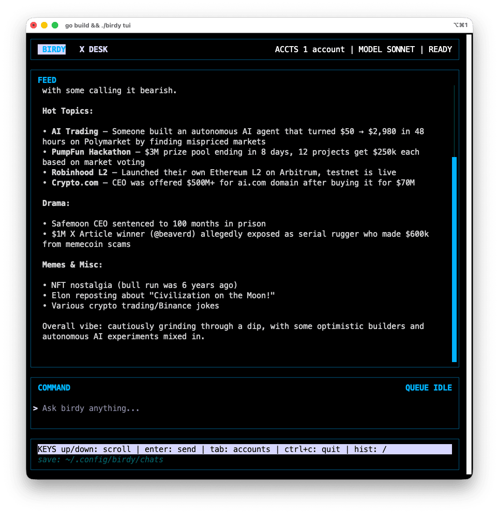
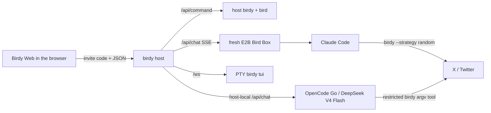

<p align="center">
  
</p>

# birdy

Lightweight multi-account X/Twitter CLI. Store multiple auth tokens and rotate
between accounts automatically to spread rate-limit pressure.

One Go binary. No Node runtime, no `node_modules`, nothing to install alongside
it.

```bash
brew trust guzus/tap && brew install guzus/tap/birdy
```

birdy began as a proxy in front of the [bird](https://github.com/steipete/bird)
CLI and still speaks its output format byte-for-byte. `--bird` runs that
original engine side by side when you install it separately, which is how
birdy's own output is verified — see [`docs/MIGRATION.md`](docs/MIGRATION.md).

## First Run (Install + Open TUI)

```bash
curl -fsSL https://raw.githubusercontent.com/guzus/birdy/main/install.sh | bash && birdy account add main && birdy tui
```

`birdy account add main` will prompt you for `auth_token` and `ct0` from your X/Twitter browser session.

## Interactive TUI

Launch the full-screen terminal interface with AI-powered chat:

```bash
birdy tui
```



The TUI features:
- **Chat** — Ask birdy to read your timeline, search tweets, post, and more via Claude or Codex
- **Deep browsing** — Say "dive deeper" and birdy will autonomously explore threads, replies, and user profiles
- **Model switching** — Press `Ctrl+T` to cycle `sonnet`, `opus`, `haiku`, and `codex`
- **Account management** — Add, remove, and view accounts with `tab`
- **Chat history** — Conversations are saved as markdown in `~/.config/birdy/chats/` (set `BIRDY_TUI_HIDE_HISTORY=1` to disable)

## Birdy Web

Birdy Web is the invite-gated React interface served by `birdy host`. It is
built for X-hitchhiking agents: a user asks for a timeline scan, research, or a
deep dive, then chooses an available server-registered model. Claude works
inside a disposable Bird Box sandbox when configured; Codex and OpenCode Go run
on the host. Each backend can use Birdy's bounded command surface, and birdy
randomly selects one configured X account for each command.

The hosted instance is available at [birdy.guzus.xyz](https://birdy.guzus.xyz).
Access is invite-only; DM [@uncanny_guzus](https://x.com/uncanny_guzus) on X to
request an invite code.

<p align="center">
  
  <br>
  <em>Bird Box — a sandbox for X-hitchhiking agents.</em>
</p>

The web app provides:

- **Timeline scans** — the selected model explores home, search, and news feeds, then turns
  the results into source-linked alpha cards.
- **Streaming chat and Deep Dive** — `/api/chat` streams model text and birdy
  tool calls to the browser over server-sent events (SSE).
- **Browser-local persistence** — chat/card history is saved in that browser's
  `localStorage`; prompts and responses still pass through the birdy host, E2B,
  and the configured model provider during a request.
- **Invite-gated access** — the browser sends the configured invite code on
  API requests. Treat it as a full service credential: it grants X data access,
  the PTY TUI, and—unless read-only mode is enabled—mutating commands. Serve the
  host over TLS, set `BIRDY_READ_ONLY=1` for public research deployments, and
  rotate the code immediately after exposure.

The lower-level `/ws` route remains available to clients that want a
PTY-backed `birdy tui` session. It is separate from the React app at `/`.

### Run locally

Build the web client, then start the Go host:

```bash
(cd web && bun install && bun run build)
BIRDY_HOST_INVITE_CODE=local-dev go run . host --addr 127.0.0.1:8787
```

Open `http://127.0.0.1:8787` and enter `local-dev`. Add at least one birdy
account first, and have Claude Code installed/authenticated for local AI chat.
When `BIRDY_E2B_TEMPLATE` and `E2B_API_KEY` are set, Claude chat is routed to
Bird Box instead of running Claude Code on the host. OpenCode Go additionally
requires the pinned `opencode` CLI and `OPENCODE_API_KEY`; its option remains
visible but disabled when the host is not configured.

### Request flow


```mermaid
flowchart LR
    Browser["Birdy Web in the browser"] -->|"invite code + JSON"| Host["birdy host"]
    Host -->|"/api/command"| Local["host birdy + bird"]
    Host -->|"/api/chat SSE"| Box["fresh E2B Bird Box"]
    Box --> Claude["Claude Code"]
    Claude -->|"birdy --strategy random"| X["X / Twitter"]
    Host -->|"host-local /api/chat"| OpenCode["OpenCode Go / DeepSeek V4 Flash"]
    OpenCode -->|"restricted birdy argv tool"| X
    Host -->|"/ws"| TUI["PTY birdy tui"]
```

Claude models use Bird Box when it is configured. Codex and OpenCode model
selections remain host-local. Each Bird Box receives only the allowlisted runtime variables,
including the complete `BIRDY_ACCOUNTS` value, and streams its result through
the host. The host requests deletion after completion, failure, disconnect, or
timeout; the sandbox TTL is the cleanup backstop if deletion cannot reach E2B.

### HTTP API

The static app at `/` and `/healthz` are public. General API operations
authenticate with `X-Invite-Code: <code>` or `Authorization: Bearer <code>`;
the harness endpoint instead requires its own per-install bearer token. `/ws`
upgrades first, then requires the invite code in its initial auth message. JSON
bodies are decoded strictly and unknown fields are rejected. General JSON API
failures use `{"ok":false,"error":"..."}`; the harness error contract also
includes a stable error code, message, and request ID.

| Endpoint | Request | Response |
| --- | --- | --- |
| `GET /healthz` | none | `200 ok` |
| `POST /api/command` | `{"command":"search","args":["agents"]}` | JSON with `ok`, `account`, `exit_code`, `stdout`, `stderr`, and `duration_ms` |
| `POST /api/multi-command` | `{"operations":[{"id":"one","command":"news"}]}` | Ordered per-operation results; maximum 16 operations |
| `GET /api/chat/models` | none beyond invite authentication | Deterministically ordered registered models with `available` and `supports_birdy_tools`; `Cache-Control: no-store` |
| `POST /api/chat` | `{"prompt":"Scan for AI agent news","model":"sonnet"}` | Zero or more `snapshot`, `token`, `tool_use`, or `error` SSE events; terminal `done` |
| `POST /api/harness/chat` | Versioned, bounded locally normalized visible-post context (see [Harness API](docs/HARNESS_API.md)) | Scoped-token SSE with `snapshot`, `token`, or sanitized `error`; terminal `done` |
| `GET /ws` | WebSocket auth message, then terminal input/resize messages | PTY-backed TUI stream |

Example read-only calls:

```bash
curl -sS https://your-birdy-host.example/api/command \
  -H 'Content-Type: application/json' \
  -H 'X-Invite-Code: replace-with-invite-code' \
  -d '{"command":"search","args":["e2b agents"]}'

curl -N https://your-birdy-host.example/api/chat \
  -H 'Content-Type: application/json' \
  -H 'X-Invite-Code: replace-with-invite-code' \
  -d '{"prompt":"Find the strongest AI-agent signals today","model":"sonnet"}'
```

The client model IDs are server-owned and bounded: `sonnet` (default), `codex`,
and `deepseek-flash`. `deepseek-flash` maps to the exact pinned runtime route
`opencode-go/deepseek-v4-flash`; the full runtime ID is accepted only as a
compatibility alias. The legacy explicit aliases `opus`, `haiku`, `gpt-5.4`,
and `gpt-5.4-mini` remain accepted. Unknown IDs return JSON `400`; a registered
but unconfigured model returns JSON `503`, both before SSE begins. Birdy never
falls back to a different provider. Successful streams include the canonical
`X-Birdy-Model-ID` response header.

OpenCode Web chat runs in a fresh temporary HOME/XDG tree with sharing,
auto-update, plugins, MCP, and every built-in tool denied. Its generated custom
`bash` replacement is not a shell: it parses a bounded command, requires the
exact Birdy executable plus an allowlisted Birdy subcommand, then launches argv
directly. It has a 60-second per-tool deadline and bounded output. The
OpenCode key reaches only the OpenCode process; the Birdy child receives the X
account pool and read-only flag but not provider, invite, or harness secrets.
The Chrome harness keeps its separate fixed, no-tools backend policy.

Command traffic is limited to 60 operations per minute per IP; a batch is
charged once per operation. Chat is limited to 20 requests per minute per IP.
At most eight bird subprocesses run concurrently across command endpoints.
For commands, HTTP `200` means the process ran; inspect `exit_code` for command
success. For chat, HTTP `200` can still contain an SSE `error` before `done`.
Write commands are **not idempotent**: never automatically retry `tweet`,
`reply`, `follow`, `unfollow`, or `unbookmark`. Set `BIRDY_READ_ONLY=1` for a
public research deployment.

The Chrome harness endpoint is a separate security boundary. It never accepts
the web invite code, cookies, raw HTML/DOM, client-selected models, commands,
account names, or arbitrary-origin page URLs. It is disabled unless
`BIRDY_HARNESS_TOKEN_HASHES` contains per-install SHA-256 token hashes. See the
[complete request, authentication, rate-limit, and MV3 contract](docs/HARNESS_API.md).

### Host command

Run birdy as a browser-accessible service:

```bash
birdy host --addr 0.0.0.0:8787
```

birdy will print the local URL:

```text
http://127.0.0.1:8787
```

Users must enter an invite code to use the APIs or PTY TUI.

Notes:
- Set invite code with `--invite-code` or `BIRDY_HOST_INVITE_CODE`.
- For public deployments, set `BIRDY_READ_ONLY=1`.
- Set `BIRDY_HOST_ALLOWED_ORIGINS` when exposing the WebSocket TUI publicly.

### Share a birdy-web conversation

Authenticated birdy-web users can publish the active conversation as a read-only
snapshot from the **Share** button. A share is not live access: later messages,
the host invite code, account credentials, tool state, and internal conversation
IDs are never included.

The browser encrypts each allowlisted snapshot with a fresh AES-GCM key. The host
stores only ciphertext under `~/.config/birdy/shares/`; the decryption key stays
after `#` in the share URL, so it is not sent to the host or reverse proxy. Anyone
who receives the full link can view and copy the snapshot. Links expire after
seven days and the creator can revoke the most recent link from the Share dialog.
Each local conversation also gets a separate opaque 256-bit replacement token,
so creating a new snapshot atomically retires its older link without sending the
local conversation ID. Storage is capped at 200 active encrypted snapshots;
expired and corrupt entries are swept during creation. Revocation prevents new
opens, but a view already in flight may finish and saved copies cannot be erased.

## Deploy on Railway

This repo now includes a Railway-ready container setup:
- `Dockerfile`
- `scripts/entrypoint-railway.sh`
- `.env.railway.example`

### 1. Create service

Create a Railway service from this repo. Railway will detect and build the `Dockerfile`.

### 2. Use or build the Bird Box template

The maintained template is public. From another E2B team, use its full
namespaced production reference:

```bash
BIRDY_E2B_TEMPLATE=binggis-default-team/bird-box:production
```

Publishing exposes only the software image; callers still supply their own E2B,
model-provider, and X credentials at runtime.

The repository includes a source-controlled E2B template builder. It
cross-compiles birdy for Linux, starts from E2B's default base image, installs a
checksummed Node 22.23.1 runtime, and bakes in the pinned Claude Code and bird
CLIs. Go and Node.js must be available on the build host, and the builder
refuses a dirty worktree by default so the binary remains traceable to a commit.

```bash
npm ci --prefix e2b-runner
E2B_API_KEY=e2b_replace-with-api-key \
  npm --prefix e2b-runner run template:build
```

The builder creates a new immutable build, launches it for a smoke test, and
moves the `bird-box:production` tag only after `birdy`, `claude`, and `bird`
all work on `PATH` as E2B's non-root sandbox user. Set
`BIRDY_E2B_TEMPLATE_NAME` or `BIRDY_E2B_PROMOTION_TAG` to override those two
names.

`bird-box:production` is a movable release pointer. For strict rollback and
repeatability, set Railway's `BIRDY_E2B_TEMPLATE` to the immutable build target
printed by the builder (`bird-box:<build_id>`).

### 3. Add required variables

Set these in Railway Variables:

```bash
# Required: invite code users enter in the browser
BIRDY_HOST_INVITE_CODE=replace-with-long-random-secret

# Optional: enable only the scoped Chrome harness endpoint. Values are
# SHA-256 hashes of independently generated per-install bearer tokens.
# BIRDY_HARNESS_TOKEN_HASHES={"install-id":"64-lowercase-hex-characters"}
# Harness v2 receives bounded normalized visible-post text from the extension;
# it needs no X account pool and never fetches X content server-side.
# BIRDY_HARNESS_BACKEND=claude-code
# BIRDY_HARNESS_MODEL=sonnet
# Alternative exact route (no automatic fallback):
# BIRDY_HARNESS_BACKEND=opencode
# BIRDY_HARNESS_MODEL=opencode-go/deepseek-v4-flash
# Also enables the normal Birdy Web `deepseek-flash` option. Remove the key to
# back out that option; Claude Sonnet remains the default.
# OPENCODE_API_KEY=replace-with-opencode-go-key
# Set only when a trusted edge overwrites X-Forwarded-For.
# BIRDY_HARNESS_TRUST_PROXY=1

# Recommended for public deployments: disable write actions
BIRDY_READ_ONLY=1

# Optional: lock websocket origins to specific public domains
# BIRDY_HOST_ALLOWED_ORIGINS=https://your-domain.example,https://<railway-domain>

# Optional: hide/disable PTY TUI chat history. Birdy Web conversations remain
# in each browser's localStorage.
BIRDY_TUI_HIDE_HISTORY=1

# Required: X/Twitter accounts as JSON (single line)
BIRDY_ACCOUNTS=[{"name":"main","auth_token":"x_auth_token_here","ct0":"x_ct0_here"}]

# Required: bird-box remote Claude execution (powered by E2B)
E2B_API_KEY=e2b_replace-with-api-key
BIRDY_E2B_TEMPLATE=bird-box:production

# Required for AI chat (pick one auth method)
CLAUDE_CODE_OAUTH_TOKEN=replace-with-claude-code-oauth-token
# or
# ANTHROPIC_API_KEY=replace-with-anthropic-api-key
# or
# ANTHROPIC_AUTH_TOKEN=replace-with-anthropic-auth-token
```

### 4. Add persistent volume

Mount a Railway volume at:

```text
/data
```

This preserves:
- `~/.config/birdy/accounts.json`
- `~/.config/birdy/state.json`
- `~/.config/birdy/chats/`
- `~/.config/birdy/shares/` (encrypted, expiring web conversation snapshots)

### Bird Box container contract

bird-box is birdy's isolated Claude execution feature, backed by E2B.
`BIRDY_E2B_TEMPLATE` must identify a custom E2B template with `birdy`, `claude`,
and the underlying `bird` CLI already on `PATH`. Use `bird-box:<build_id>` for
an immutable pin, or a movable version tag such as `bird-box:production`. The
web host does not install these binaries or Node.js inside a running container.

Each Claude chat request gets a fresh bird-box container. The host forwards only
Claude authentication plus `BIRDY_ACCOUNTS` and `BIRDY_READ_ONLY`; the E2B API
key and birdy invite code never enter the sandbox. Output streams through the
existing SSE endpoint. The host immediately requests sandbox deletion after
completion, failure, disconnect, or timeout; the default seven-minute sandbox
TTL is the cleanup backstop if that request cannot reach E2B. Since rotation
state is ephemeral, Claude inside bird-box uses `birdy --strategy random`
instead of restarting round-robin at the first account.

The command, sandbox, and E2B request timeouts can be overridden with
`BIRDY_E2B_COMMAND_TIMEOUT_MS`, `BIRDY_E2B_SANDBOX_TIMEOUT_MS`, and
`BIRDY_E2B_REQUEST_TIMEOUT_MS`. The sandbox timeout must cover command startup,
execution, and cleanup. The two E2B request handshakes, command timeout, and
cleanup timeout must also fit inside the remaining web request deadline, which
the Go host passes to the runner internally; invalid combinations fail before
creating a sandbox.

### 5. Deploy and open

After deploy, open your Railway public URL and enter your invite code:

```text
https://<your-service-domain>
```

### Railway notes

- Keep this service at `1` replica so account rotation and persisted rate-limit
  state remain coherent. Browser conversations remain client-side.
- The container uses Node 22 + the Claude Code CLI. Node is there because Claude
  Code is a Node application, not because birdy needs it.
- Rotate `BIRDY_HOST_INVITE_CODE` if it leaks.

## How it works

birdy sits in front of the `bird` CLI. When you run a bird command through birdy, it:

1. Picks an account from your stored credentials using a rotation strategy
2. Injects the `AUTH_TOKEN` and `CT0` environment variables
3. Forwards the command to `bird`
4. Tracks usage per account for smart rotation

## VPN routing (`--vpn`)

X's bot detection blocks by IP, so rotating auth tokens across several accounts
from one machine still trips Cloudflare after ~30 lookups. `--vpn` routes each
call through a SOCKS5 endpoint (NordVPN's service credentials work out of the
box), with per-invocation server selection so you can rotate exits as well as
accounts.

```bash
# One-time setup
birdy vpn set --user <NORDVPN_SERVICE_USERNAME> --pass <NORDVPN_SERVICE_PASSWORD>
birdy vpn pool add us9876.nordvpn.com               # add as many as you want
birdy vpn pool add jp14.nordvpn.com

# Per-invocation
birdy --vpn user-tweets @handle                     # random server from pool
birdy --vpn-server us9876.nordvpn.com whoami        # pin specific exit
birdy vpn test                                      # show the egress IP
birdy vpn status                                    # config (password masked)
```

How it works: birdy dials the SOCKS5 endpoint directly and hands the resulting
dialer to Go's HTTP transport, so every request for that invocation egresses
through the exit. `-v` prints which one it picked.

The `--bird` path is the exception. Node's `fetch` honours neither SOCKS5 nor
the proxy environment variables, so routing it needs a local HTTP CONNECT
bridge and a userspace `undici` (`birdy vpn install-deps`). None of that is
involved unless you explicitly combine `--bird` with `--vpn`.

NordVPN service credentials are different from your account login — find them in the NordVPN dashboard under **Services → NordVPN → Set up NordVPN manually**.

## Install

### Homebrew

```bash
brew trust guzus/tap                 # Homebrew refuses to load third-party taps until trusted
brew install guzus/tap/birdy
```

The tap-qualified name is the whole install: it taps `guzus/homebrew-tap` on the
way in, so there is no separate `brew tap` step. Upgrades are plain
`brew upgrade birdy` once the formula is installed.

Trusting is not optional. Homebrew 6 raises `Refusing to load formula
guzus/tap/birdy from untrusted tap guzus/tap` on install, and `brew trust`
resolves a tap you have not added yet, which is why it comes first.

The short `brew install birdy` is not offered: with no tap prefix Homebrew
resolves it against homebrew-core, where birdy is not published.

### Script


```bash
curl -fsSL https://raw.githubusercontent.com/guzus/birdy/main/install.sh | bash
```

Requires the [GitHub CLI](https://cli.github.com) (`gh`). To install a specific version, pass it as an argument: `... | bash -s v0.2.0`

### Alternatives

```bash
# From source (requires Go)
go install github.com/guzus/birdy@latest

# Build locally
git clone https://github.com/guzus/birdy.git && cd birdy && make build

# Maintainer verification
make verify
```

`go install` gives you the same single binary as any other route — birdy needs
nothing else to run.

A git clone additionally vendors bird under `third_party/@steipete/bird/`. That
copy is a build-time and verification input — `scripts/gen-features.mjs`
generates from it and `scripts/diff-engines.sh` compares against it — not
something birdy runs.

## Updating

```bash
birdy update            # download and install the latest release
birdy update --check    # report whether one exists, change nothing
```

`update` refuses to touch a binary a package manager owns. Installed through
Homebrew, it tells you to run `brew upgrade birdy` instead — overwriting the
Cellar copy would leave brew's manifest describing a file that is no longer
there, and its next upgrade would silently undo the update.

Downloads are checked against the release's published SHA-256 before anything
is installed, and the swap is atomic, so an interrupted update leaves the
existing binary in place.

## Prerequisites

- The installer places a single binary. Nothing else is unpacked and no Node
  runtime is required.
- [Claude Code](https://claude.ai/claude-code) (`claude` CLI) or [Codex CLI](https://github.com/openai/codex) (`codex` CLI) — required for the interactive TUI (`birdy tui`)

Optional:
- `BIRDY_TUI_CODEX_MODEL` — override the Codex model used by the `codex` TUI slot (default: `gpt-5.4-mini`)

To force a specific bird binary, set `BIRDY_BIRD_PATH=/path/to/bird`.

## Quick start

```bash
# Add accounts (you'll be prompted for auth_token and ct0)
birdy account add personal
birdy account add work
birdy account add alt

# Or pass credentials directly
birdy account add bot --auth-token "xxx" --ct0 "yyy"

# Restrict a specific account to read-only bird commands
birdy account update bot --read-only

# Now use bird commands through birdy - accounts rotate automatically
birdy read 1234567890
birdy search "golang"
birdy home
birdy mentions
birdy activity 1234567890 --types likes,reposts --json

# See which account was used with --verbose
birdy -v home

# Use a specific account
birdy --account personal whoami

# Check rotation status
birdy status

# List accounts
birdy account list
```

## Scrape

`birdy scrape` collects tweets from profiles, lists, searches, and tweet URLs
in one command. It accepts mixed targets, structured search filters,
Latest+Top ranking, and JSON, flat, or CSV export. Results are deduplicated
before output.

```bash
# Profile, search, and tweet URLs in one run
birdy scrape https://x.com/nasa https://x.com/search?q=moon --max-items 50

# Bulk handles
birdy scrape --handle elonmusk --handle nasa -n 100

# Structured filters compile to X advanced-search syntax
birdy scrape --from nasa --since 2026-01-01 --min-likes 100 --filter media

# Combined Latest + Top search, spreadsheet output
birdy scrape --search "AI lang:en" --sort both --output csv

# Engagement modes
birdy scrape --mode replies https://x.com/nasa/status/2090197889947451524
birdy scrape --mode quotes --id 2090197889947451524
```

`--mode` accepts `auto` (default), `tweet`, `search`, `profile`,
`profile-replies`, `profile-media`, `profile-likes`, `list`, `replies`,
`quotes`, `thread`, `retweeters`, and `favoriters`. `--output` is `json`
(default), `flat` (nested JSON plus spreadsheet columns), or `csv`.

Bare words are search terms (`birdy scrape AI`). Use `--handle nasa` or
`@nasa` when the target is a profile.

## Following Overlap

Find accounts followed by at least N accounts from a seed set:

```bash
birdy following-overlap elonmusk sama --min 2
```

The default output is tab-separated:

```text
2	@example	Example Account	1000000 followers	elonmusk,sama
```

Use `--json` for scripts, `--max-pages N` for a bounded sample, and `--page-size N` to tune pagination. By default, birdy fetches all following pages for each seed account and rotates through configured birdy accounts just like normal forwarded bird commands.

## Account management

```bash
birdy account add <name>        # Add account (interactive or with --auth-token/--ct0)
birdy account add <name> --read-only
birdy account list              # List all accounts with access mode + usage stats
birdy account update <name>     # Update credentials for an account
birdy account update <name> --read-only
birdy account update <name> --read-write
birdy account remove <name>     # Remove an account
```

Use `--read-only` on add or update to keep a specific account available for reads while blocking mutating bird commands like `tweet`, `reply`, `follow`, `unfollow`, and `unbookmark`. Use `--read-write` to lift that restriction.

## Rotation strategies

Control how birdy picks the next account with `--strategy` / `-s`:

| Strategy | Description |
|---|---|
| `round-robin` (default) | Cycles through accounts in order |
| `least-recently-used` | Picks the account used longest ago |
| `least-used` | Picks the account with the fewest total uses |
| `random` | Picks a random account |

```bash
birdy -s least-used search "rust"
birdy -s random home
```

## Native Go engine

birdy serves these commands itself, in Go, with no Node.js and no `bird` binary:

`read` `thread` `replies` `search` `home` `user-tweets` `bookmarks`
`list-timeline` `whoami` `about` `likes` `followers` `following`
`tweet` `reply` `follow` `unfollow` `unbookmark` `check` `mentions`
`query-ids` `lists` `activity` `news`

That is every command birdy has. Nothing forwards to
[bird](https://github.com/steipete/bird), and the release ships no bird and no
`node_modules`.

`--bird` still runs the original engine when you install bird separately
(`npm install -g @steipete/bird`). It is how birdy's output is checked against
the engine it replaced — see [`docs/MIGRATION.md`](docs/MIGRATION.md).

`query-ids` is the one command that deliberately does not match bird's output:
bird's reports bird's cache, its path and its feature overrides, and birdy has
a separate resolver with a different cache and a different override mechanism
(`BIRDY_<OPERATION>_QUERY_ID`). Printing bird's shape would describe a file
birdy never reads. See [`COMPATIBILITY.md`](COMPATIBILITY.md).

Posting, replying, following and unbookmarking are served natively, and they
inherit the same guards as the bird path: `BIRDY_READ_ONLY=1` and per-account
`read_only` are enforced before the engine is chosen, so making a command
native is never a way around them. None of the write commands retry — a
timed-out post may have landed, and a duplicate is worse than a reported
failure. Media upload is not implemented, so a post carrying `--media` still
falls back to bird rather than silently dropping the attachment.

`whoami` resolves the account behind the current credentials, which is also what
lets `likes` match bird's signature — bird's `likes` takes no handle and reads
the authenticated account's likes.

Output is byte-identical to bird's for `--plain` and `--no-emoji`, because the
birdy skill and TUI read the human-readable form. `--json` matches key-for-key
and in key order, with the narrow exceptions listed in
[COMPATIBILITY.md](COMPATIBILITY.md#the-bird-passthrough-and-removing-it)
(U+2028/U+2029 escaping, rare `article` body shapes, `query-ids`). Verified by
diffing both engines against live X.

Force the bird path when you need it:

```bash
birdy --bird read <id>       # this invocation
BIRDY_USE_BIRD=1 birdy home  # everything in this shell
```

A command carrying a flag the native path does not implement yet (`--all`,
`--max-pages`, `--cursor`, `--json-full`, …) automatically falls back to bird
rather than silently ignoring the flag.

```bash
birdy -v search golang   # prints which engine served the command
```

## Go library (`pkg/tweet`)

Embed birdy in a Go service to read tweets without shelling out to the CLI or
running `birdy host`. Reads are implemented **natively in Go** against X's
GraphQL API, so this path needs no Node.js and no bird CLI.

```go
import "github.com/guzus/birdy/pkg/tweet"

client, err := tweet.NewMonitoringClient(tweet.MonitoringOptions{
    // Accounts come from BIRDY_ACCOUNTS + ~/.config/birdy/accounts.json by
    // default, or pass AccountsJSON to supply them from your own config.
    Strategy: "quota-aware", // the default
    // Restrict reads to this pool when other stored accounts are reserved for
    // posting. Unknown names fail at construction.
    AccountPool: []string{"reader-1", "reader-2"},
})

t, err := client.Read(ctx, "https://x.com/SpaceX/status/2084912076502282341")
for _, m := range t.Media {
    fmt.Println(m.Type, m.DownloadURL()) // videos resolve to the mp4, not the thumbnail
}

// ReadPost returns the strict monitoring shape for one exact post, including
// its structured reply, quote, and repost relations.
post, err := client.ReadPost(ctx, t.ID)
fmt.Println(post.InReplyToStatusID, post.QuotedTweet, post.RepostedTweet)

// Conversations come back flat; ancestry lives in InReplyToStatusID.
thread, err := client.Thread(ctx, t.ConversationID)
parents := tweet.AncestorChain(thread, t.ID) // root-first, target excluded

// Poll posts, quotes, and reposts without invoking bird/Node. Reposts carry an
// explicit relation rather than requiring an "RT @" text heuristic.
timeline, err := client.UserTimeline(ctx, "@thsottiaux", tweet.UserTimelineOptions{
    Limit: 100,
})
for _, post := range timeline.Tweets {
    fmt.Println(post.ID, post.RepostedTweet != nil)
}

// Replies are a separate Latest Search stream with an independent cursor.
replies, err := client.UserReplies(ctx, "@thsottiaux", tweet.UserTimelineOptions{
    Limit: 100,
})

profile, err := client.UserProfile(ctx, "@thsottiaux")
if profile.Followers != nil {
    fmt.Println(*profile.Followers)
}

// A following-graph reconciliation is safe only when Complete is true.
following, err := client.Following(ctx, "1953337039510003712", tweet.FollowingOptions{
    PageSize: 100,
    MaxPages: 20,
})
if !following.Complete {
    log.Printf("skip reconciliation; resume cursor: %s", following.NextCursor)
}
```

Notes:

- **No Node required.** `internal/xapi` speaks X's GraphQL API directly, using
  the same auth a browser session does: X's public web bearer token plus your
  `auth_token` cookie and `ct0` CSRF token.
- A `Client` is safe for concurrent use and holds rotation state in memory, so
  it works on a read-only filesystem (Cloud Run, scratch containers). Account
  selection reserves in-flight calls atomically, so synchronized readers spread
  across the pool instead of all choosing the same stale usage snapshot.
- Passing `Options.AccountsJSON` builds an ephemeral store that never writes to
  disk. Useful when credentials come from your own secret manager.
- `MonitoringOptions.AccountPool` is an allowlist over the configured store.
  Selection and rotation never leave that pool; this keeps read automation away
  from accounts reserved for posting. It lives on the new monitoring
  constructor so the frozen `Options` layout remains source-compatible.
- The default strategy is `quota-aware`, which avoids accounts that recently
  returned a 429 or a rate-limit error inside an HTTP-200 GraphQL envelope.
  `tweet.IsRateLimited(err)` exposes that classification to callers.
- Cancelling the context aborts the in-flight request.
- `tweet.ExtractTweetID` parses status URLs and bare IDs, rejecting anything
  that is not a tweet reference.
- Timeline and following cursors are opaque X values. Forward them unchanged;
  do not parse them or infer chronology from them. The one exception is X's own
  end-of-list sentinel on a user list: a Bottom cursor whose leading component
  is `0` (`0|2087029644107709401`) means there is nothing after this page, the
  same thing v1.1 says with `next_cursor_str: "0"`. It is consumed, not
  forwarded — following it returns an empty page and another `0|` cursor with a
  changed suffix, indefinitely. `NextCursor` is empty at a real end of list.
- `Following` keeps one selected account for the entire page walk, preserves
  X's order, and de-duplicates overlapping user IDs. `Complete` is true only
  after a walk starting without a cursor reaches X's terminator. A `MaxPages`
  cap returns the collected users with `Complete=false` and `NextCursor`; an X
  or transport failure returns an error instead of a partial snapshot.
- Any following list of a few hundred accounts contains some X will not render:
  suspended, deactivated, or hidden from the reading account. They are still
  members, so they are returned with `Unavailable: true` and **only `ID` set** —
  no username, name, or counts. Diff snapshots by ID, treat these as still
  followed, and keep whatever identity you already stored for them rather than
  overwriting it with the blanks. Their id is recovered from X's timeline entry
  key; on the rare shape where even that is missing, the page errors rather
  than quietly shrinking the list into a false unfollow.
- Following-user descriptions and counts are pointers: `nil` means X omitted
  the value, while a pointer to zero or an empty string means it was reported.
- `UserTimeline` reads X's Posts tab; it does not promise replies. `UserReplies`
  reads `from:<handle> filter:replies` from reverse-chronological Latest Search.
  The two streams have independent cursors and should be merged by tweet ID and
  `CreatedAt`.
- Timeline results use `TimelineTweet`, which embeds the frozen `Tweet` type and
  adds `RepostedTweet` only on this new monitoring surface. Existing unkeyed
  `Tweet` literals therefore continue to compile unchanged.
- `ReadPost` returns that same monitoring shape for one exact tweet and fails
  closed when a present quote or repost relation is malformed. Legacy `Read`
  retains its existing return type and behavior.
- A timeline `Limit` is a target capped at 200, not a truncation boundary. The
  full terminal response page is returned, so the slice may exceed `Limit` but
  `NextCursor` never skips entries X over-delivered on that page.
- Missing or moved collection roots are errors. Only a recognized, present
  collection with zero entries is treated as an empty timeline/following list.
- `UserProfile` exposes the native handle lookup's identity and counts. Nil
  count pointers mean X omitted a value; a pointer to zero is a reported zero.

### Scope

`pkg/tweet` covers single tweets, conversations, bounded post and reply streams,
profiles, and complete-or-explicitly-incomplete following snapshots. This is
narrower than the CLI on purpose: only contracts needed by embedded readers are
exported, since every exported identifier is frozen by semver.

Widening it is incremental work — the engine already exists, what is missing is
the deliberate decision to commit to each signature. See
[`COMPATIBILITY.md`](COMPATIBILITY.md).

### Benchmarks

Reads used to run through the bird CLI, a Node program spawned per call. They now
run in-process in Go. Here is what that actually changed.

Both paths wait on X's API, which takes **~1.5s and varies between calls by more
than the two implementations differ from each other**. Benchmarking against the
live API measures network weather, not code. So the numbers below isolate the
work each client does that is *not* waiting on X: for Go, the full client path
(build query → HTTP → decode) against a local server; for bird, process spawn
plus module load, measured by running it with a missing argument so it exits
before opening a socket.

| | bird (Node subprocess) | `pkg/tweet` (Go, in-process) | |
| --- | --- | --- | --- |
| Per-call overhead, excluding network | 80.6 ms | **0.43 ms** | ~190× |
| Memory per in-flight read | 60 MB resident | **0.29 MB** allocated | ~200× |
| 32 concurrent reads | 374 ms, ~1.9 GB resident | one process, pooled connections | |
| Decode a 50-tweet conversation | — | 0.27 ms (180 MB/s) | |
| Runtime dependency | Node + `@steipete/bird` | **none** | |
| **End-to-end vs live X** | **~1.5 s** | **~1.5 s** | **parity** |

**Read the last row before quoting the first.** Per-request latency is
unchanged, because X dominates it. If you make one read and wait, this work
bought you nothing measurable.

What it does buy: no Node in the image, and headroom under concurrency. Node's
spawn cost amortizes across cores (129 ms/op at N=1 falls to 11.7 ms/op at
N=32), so throughput alone is survivable — the binding constraint is memory. At
32 in-flight reads the subprocess model wants ~1.9 GB resident, which exceeds a
default Cloud Run instance; the Go path serves the same load from one process
with a pooled connection.

The honest framing is that this is not *Go vs Node*. It is *in-process call vs
subprocess per request*. An in-process Node library would land in much the same
place. The language is incidental; the process boundary was the cost.

Reproduce, including hardware and versions:

```bash
./scripts/bench-go-vs-bird.sh          # hermetic; no rate-limit budget spent
./scripts/bench-go-vs-bird.sh --live   # adds the end-to-end row against real X
```

Measured on an Apple M5 Pro, go1.26.5, node v26.5.0. Go figures come from
`go test -bench` over `internal/xapi`, so `go test ./internal/xapi/ -bench=.`
reproduces them directly.

### Query IDs

X's GraphQL persisted-query hashes rotate. `internal/xapi` tries each known
`TweetDetail` id in turn and reports a clear error when all are rejected. If X
rotates faster than this repo updates, override without a release:

```bash
export BIRDY_TWEET_DETAIL_QUERY_ID=<current-hash>
```

## Getting auth tokens

You need two cookies from an active X/Twitter web session:

1. Open X/Twitter in your browser and log in
2. Open Developer Tools (F12) > Application > Cookies > `https://x.com`
3. Copy the values of `auth_token` and `ct0`

Repeat for each account you want to add.

## GitHub Actions / CI

In CI environments where there's no interactive terminal, set the `BIRDY_ACCOUNTS` env var with a JSON array of accounts:

```bash
export BIRDY_ACCOUNTS='[{"name":"bot1","auth_token":"xxx","ct0":"yyy","read_only":true},{"name":"bot2","auth_token":"aaa","ct0":"bbb"}]'
birdy -v read 1234567890
```

When `BIRDY_ACCOUNTS` is set and no accounts file exists on disk, birdy runs in ephemeral mode — accounts are loaded from the env var and nothing is written to disk.

If an accounts file also exists, env accounts are merged in (overriding any file account with the same name).

### GitHub Actions example

Store the JSON as a repository secret named `BIRDY_ACCOUNTS`, then use it in your workflow:

```yaml
- name: Read a tweet
  env:
    BIRDY_ACCOUNTS: ${{ secrets.BIRDY_ACCOUNTS }}
  run: birdy -v read 1234567890
```

See [`.github/workflows/example.yml`](.github/workflows/example.yml) for a full workflow.

## Config location

Accounts are stored in `~/.config/birdy/accounts.json` with `0600` permissions (owner-only read/write). Rotation state is tracked in `~/.config/birdy/state.json`.

## Compatibility

birdy follows semantic versioning. [`COMPATIBILITY.md`](COMPATIBILITY.md) states
exactly which surfaces that covers — `pkg/tweet`, command and flag names,
`--json` output, and the account store schema — and which it deliberately does
not, most importantly birdy's behavior against X's unversioned GraphQL API.

It also covers what the ongoing [port from bird to native Go](#native-go-engine)
does and does not promise: command names and output survive the port, so
dropping the Node.js dependency is not a breaking change.

## License

MIT
